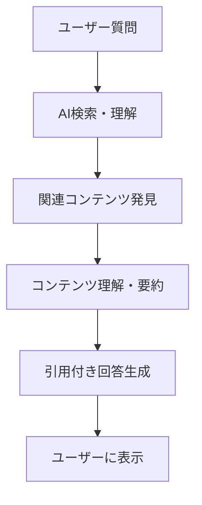

# AEO最適化戦略 - AI回答エンジン最適化

このドキュメントは、ChatGPT、Claude、Gemini等のAI回答エンジンでコンテンツが引用・要約されやすくするための戦略を定義します。

## AEOの基本概念

### AEO（Answer Engine Optimization）とは
- **定義**: AI回答エンジンが質問に対する回答でコンテンツを引用・要約しやすくする最適化
- **対象エンジン**: ChatGPT、Claude、Gemini、Copilot等
- **従来SEOとの違い**: クローラーではなくAIが直接コンテンツを理解・引用

### AI引用の仕組み


## AEO最適化の核心戦略

### 1. 質問形式への対応

**戦略**: ユーザーが実際にAIに質問する形式に合わせてコンテンツを構成

**実装方法**:
- 見出しを質問形式にする（「○○とは何ですか？」「○○の方法は？」）
- 質問の直後に明確で完結な回答を配置
- 詳細説明は回答の後に続ける

**悪い例**:
```markdown
# マーケティング戦略について
マーケティング戦略は企業が...
```

**良い例**:
```markdown
# マーケティング戦略とは何ですか？
マーケティング戦略とは、企業が顧客に価値を届けるための包括的な計画です。

## 詳細説明
マーケティング戦略には以下の要素が含まれます...
```

### 2. 構造化情報の提供

**戦略**: AIが理解・要約しやすい明確な情報構造を提供

**実装方法**:
- リスト形式での情報整理
- 段階的説明（ステップ1、ステップ2...）
- 表形式での比較・整理
- 明確な結論・まとめの配置

**構造例**:
```markdown
## 問題解決の3ステップ

1. **現状分析**: 現在の状況を客観的に把握する
2. **課題特定**: 解決すべき問題を明確にする  
3. **解決策実行**: 具体的なアクションを実施する

### 各ステップの詳細
| ステップ | 所要時間 | 必要スキル | 期待効果 |
|---------|----------|------------|----------|
| 現状分析 | 1-2時間 | 分析力 | 課題の明確化 |
```

### 3. ファクトベース記述

**戦略**: 検証可能な事実に基づく記述でAIの信頼性判定を向上

**実装方法**:
- 統計データの引用と出典明記
- 具体的な数値・日付の使用
- 権威ある情報源への言及
- 個人の体験と一般的事実の明確な分離

**信頼性向上の例**:
```markdown
## SNSマーケティングの効果

### 統計データ（2024年調査）
- 企業の73%がSNSマーケティングで売上向上を実感（日本マーケティング協会調査）
- 平均的なROIは3.2倍（調査対象：中小企業100社）

### 実装時の注意点
1. プラットフォーム選択（データ基準）
2. コンテンツ品質（体験談込み）
```

## AI引用パターン分析

### 高引用率コンテンツの特徴

1. **即答性**: 質問に対する明確で短い回答
2. **完結性**: そのトピックについて包括的な情報
3. **構造性**: AIが要約しやすい論理的構造
4. **信頼性**: 検証可能な情報源と事実

### 引用されにくいコンテンツパターン

- 主観的意見のみの内容
- 曖昧で抽象的な表現が多い
- 情報が散在している
- 古い情報や出典不明の情報

## AEO測定指標

### 直接指標
- AI回答での引用回数（測定ツール使用）
- 引用時の情報正確性
- 引用部分の割合

### 間接指標  
- note記事への直接流入増加
- 「AI経由」でのブランド認知向上
- エンゲージメント率の向上

## AEO実装チェックリスト

### コンテンツ構造
- [ ] タイトルが質問形式または回答しやすい形式
- [ ] 冒頭に明確で完結な回答を配置
- [ ] 見出し構造が論理的で階層的
- [ ] リスト・表・段階的説明を活用

### 情報品質
- [ ] ファクトベースの情報に出典を明記
- [ ] 数値データを具体的に記載
- [ ] 個人意見と一般的事実を分離
- [ ] 最新性を保った情報更新

### AI理解性
- [ ] 専門用語に説明を併記
- [ ] 文章が明確で理解しやすい
- [ ] 情報の関連性が明確
- [ ] 結論・まとめが明示的

## AEO戦略の進化対応

### AI技術の変化への対応
- 新しいAI回答エンジンの特性調査
- 引用パターンの継続的分析
- 最適化手法の定期的更新

### コンテンツ戦略との統合
- 従来SEOとの両立
- ブランド戦略との一致
- 読者価値の維持

この戦略により、AI時代における情報発見性と権威性を同時に向上させることができます。