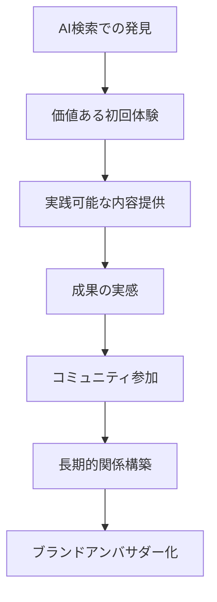

# 読者エンゲージメント最適化 - AI時代の読者関係構築

このドキュメントは、AI検索最適化と読者エンゲージメント向上を両立させる戦略を定義します。

## AI時代のエンゲージメント戦略

### 従来vs AI時代のエンゲージメント比較

| 要素 | 従来型 | AI時代 |
|------|--------|--------|
| 発見経路 | 検索→記事 | AI回答→記事 |
| 読者期待 | 情報収集 | 解決策実行 |
| エンゲージメント | いいね・シェア | 実践・成果報告 |
| 関係性 | フォロワー | 実践コミュニティ |

### AI最適化とエンゲージメントの統合アプローチ



## 読者ペルソナとAI検索行動の分析

### AI時代の読者分類

**1. 効率重視型（40%）**
- **特徴**: 短時間で具体的解決策を求める
- **AI利用**: 質問→即座の実行可能な回答を期待
- **エンゲージメント戦略**: ステップバイステップガイド、チェックリスト

**2. 深掘り学習型（35%）**
- **特徴**: 理解を深めて応用したい
- **AI利用**: 概要把握→詳細情報収集
- **エンゲージメント戦略**: 背景理論、応用事例、発展的内容

**3. 検証慎重型（25%）**
- **特徴**: 複数情報源で確認してから実行
- **AI利用**: 比較検討→信頼性確認
- **エンゲージメント戦略**: データ根拠、他手法との比較、リスク説明

### ペルソナ別コンテンツ設計

**効率重視型向けの例**:
```markdown
# 副業で月5万円稼ぐ最短ルート【30日チャレンジ】

## 今すぐできる3ステップ（1日目）
1. **スキル棚卸し（30分）**
   - [ ] Excel操作レベル確認
   - [ ] 文章作成経験の整理
   - [ ] 利用可能時間の算出

2. **案件サイト登録（1時間）**
   - [ ] クラウドワークス登録
   - [ ] ランサーズ登録  
   - [ ] プロフィール作成

3. **初回提案送信（2時間）**
   - [ ] データ入力案件を5件選定
   - [ ] 提案文テンプレート活用
   - [ ] 提案送信完了

## 30日後の目標
- 初案件受注完了
- 月5万円の収入基盤構築
- 次のステップへの準備完了
```

## エンゲージメント設計フレームワーク

### 1. 価値提供の段階設計

**Tier 1: 即時価値（記事内完結）**
- 読んですぐ実行できる具体的手順
- ダウンロード可能なテンプレート・ツール
- チェックリスト形式の確認項目

**Tier 2: 継続価値（シリーズ連携）**
- 段階的スキルアップコンテンツ
- 実践結果のフィードバック機会
- 応用・発展的な情報提供

**Tier 3: コミュニティ価値（参加型）**
- 読者同士の交流・情報共有
- 成功事例・失敗談の共有
- 専門家との直接対話機会

### 2. エンゲージメント促進の仕組み

**実践促進の設計**:
```markdown
## 読者アクション設計の例

### 記事内アクション
**行動喚起**: 「この記事を読んだら、まず最初に○○をやってみましょう」
**進捗確認**: 「1週間後、どの段階まで進んだかコメントで教えてください」
**成果共有**: 「成功した方は#副業チャレンジで結果をシェアしてください」

### フォローアップ設計
1. **7日後**: 進捗確認記事の投稿
2. **30日後**: 結果分析と次ステップ提示
3. **90日後**: 成功事例の紹介と上級編への誘導
```

## AI検索フレンドリーなエンゲージメント設計

### 1. 質問誘発型コンテンツ

**AI検索での再発見を促す構造**:
```markdown
# プログラミング学習で挫折しそうなときの対処法

## よくある挫折ポイント（AI検索されやすい質問形式）

### 「エラーが解決できない時はどうすれば？」
**即答**: エラーメッセージをGoogle検索 + Stack Overflow確認

**詳細解決法**:
1. エラーメッセージの完全コピー
2. 使用言語とバージョンを明記
3. 再現手順の整理
4. 専門フォーラムでの質問

### 「モチベーションが続かない時は？」
**即答**: 小さな成功体験を積み重ねる

**具体的方法**:
- 1日1つの小さな機能実装
- 学習記録の可視化
- 同じ目標の仲間との交流
```

### 2. AI引用されやすい成功事例

**構造化された事例提示**:
```markdown
## 成功事例: 未経験から6ヶ月でWeb制作案件獲得

### 基本情報
- **年齢**: 32歳
- **前職**: 営業職（IT経験なし）
- **学習時間**: 平日2時間、休日4時間
- **投資額**: 5万円（教材・ツール）

### 学習プロセス
| 期間 | 学習内容 | 成果 | 使用時間 |
|------|----------|------|----------|
| 1-2ヶ月 | HTML/CSS基礎 | 簡単なWebページ作成 | 80時間 |
| 3-4ヶ月 | JavaScript基礎 | 動的サイト作成 | 120時間 |
| 5-6ヶ月 | 実践制作 | ポートフォリオ完成 | 100時間 |

### 最終成果
- **初案件**: 企業サイトリニューアル（15万円）
- **受注期間**: 学習開始から6.5ヶ月
- **継続**: 月2-3件のペースで案件獲得継続中
```

## エンゲージメント測定と改善

### 測定指標の設計

**直接エンゲージメント指標**:
- コメント数と質の分析
- 実践報告・成果シェアの数
- 質問・相談の頻度

**間接エンゲージメント指標**:
- 記事の滞在時間・完読率
- 関連記事への回遊率
- SNSでの言及・拡散状況

**AI経由エンゲージメント指標**:
- AI検索経由の流入数
- AI引用時の元記事へのアクセス
- AI経由読者の行動パターン

### A/Bテストによる最適化

**エンゲージメント向上のテスト例**:
```markdown
## 行動喚起の表現テスト

### パターンA（指示型）
「今すぐ以下の手順を実行してください」
→ 実行率: 23%

### パターンB（提案型）  
「良かったら、以下の方法を試してみてください」
→ 実行率: 31%

### パターンC（共感型）
「私も最初は同じ悩みでした。この方法で解決できました」
→ 実行率: 45%

**結論**: 共感型アプローチが最も効果的
```

## コミュニティ型エンゲージメント戦略

### 実践コミュニティの構築

**段階的コミュニティ参加設計**:
```markdown
## コミュニティ参加の段階

### Stage 1: 情報消費者
- 記事の定期的読者
- たまにコメントやリアクション
- 他の読者の体験談を参考にする

### Stage 2: 実践報告者
- 学習・実践の進捗を定期報告
- 困った時にコミュニティに質問
- 他の初心者にアドバイス提供

### Stage 3: 知識共有者
- 独自の成功・失敗体験を詳細共有
- 新しい手法・ツールの紹介
- 初心者の相談に積極的に対応

### Stage 4: コミュニティリーダー
- イベント・勉強会の企画・運営
- 専門知識での定期的な情報発信
- ブランドアンバサダーとしての活動
```

### エンゲージメント品質の向上

**高品質な相互作用の促進**:
```markdown
## コミュニティガイドライン

### 推奨される投稿・コメント
- 具体的な数値・事例を含む報告
- 他の人にも役立つ情報共有
- 建設的な質問・アドバイス

### 避けるべき投稿・コメント  
- 曖昧で抽象的な感想のみ
- 他の参加者への批判・否定
- 商業的な宣伝・勧誘
```

## エンゲージメント最適化チェックリスト

### コンテンツ設計
- [ ] 読者の即時実行可能な価値を提供
- [ ] 段階的なフォローアップ設計
- [ ] 質問誘発型の構造を含む
- [ ] 成功事例が構造化されている

### 相互作用設計
- [ ] 明確で魅力的な行動喚起
- [ ] 進捗報告・成果共有の仕組み
- [ ] 読者同士の交流機会提供
- [ ] コミュニティガイドラインの明示

### AI最適化連携
- [ ] AI検索での再発見を考慮した構造
- [ ] 引用されやすい事例・データ配置
- [ ] 質問形式での情報整理
- [ ] 独立して理解できる情報ブロック

この戦略により、AI時代における読者との深い関係構築と継続的なエンゲージメント向上を実現できます。