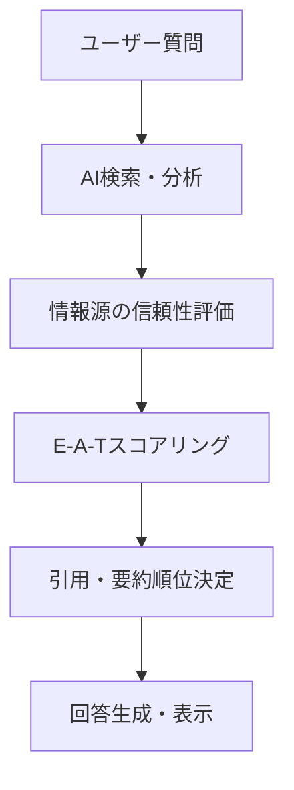
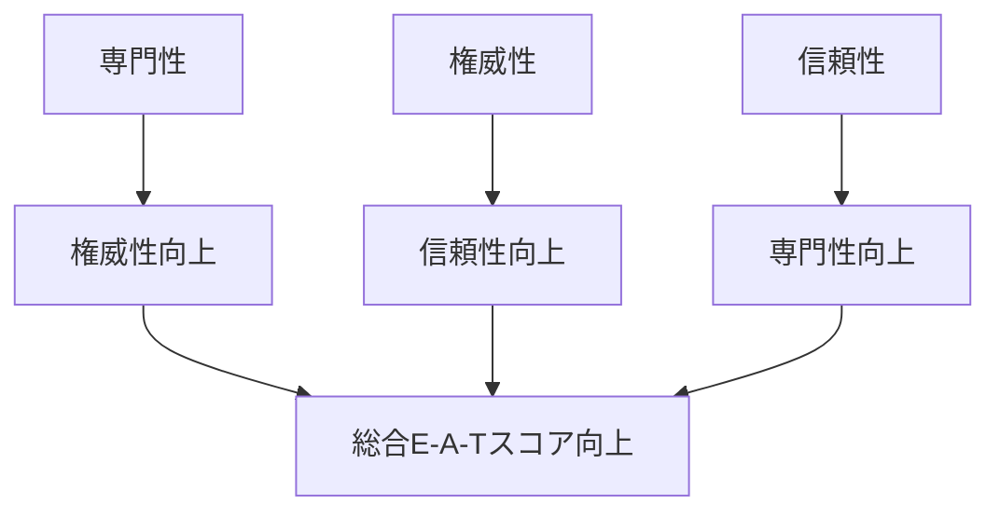

# 権威性構築手法 - E-A-T最適化戦略

このドキュメントは、AI検索エンジンでの信頼度向上と権威性構築のための体系的手法を定義します。

## E-A-Tの基本概念

### E-A-T定義
- **E**xpertise（専門性）: 特定分野での深い知識と技能
- **A**uthoritativeness（権威性）: 業界・分野での認知と信頼
- **T**rustworthiness（信頼性）: 情報の正確性と透明性

### AI時代のE-A-T重要性


## 専門性（Expertise）構築戦略

### 1. 専門分野の明確化

**特化戦略の実装**:
```markdown
❌ 幅広すぎる例:
「ビジネス全般について情報発信」

✅ 特化した例:
「SaaS企業のマーケティング戦略」
「フリーランスエンジニアの案件獲得術」  
「副業ライターの収益化方法」
```

**専門性の段階的構築**:
```markdown
## 専門性レベルの設計

### Level 1: 基礎知識（3-6ヶ月）
- 業界の基本用語・概念の習得
- 代表的な課題と解決策の理解
- 初心者向け情報の体系化

### Level 2: 実践経験（6-12ヶ月）  
- 実際の成功・失敗事例の蓄積
- 独自の視点・手法の開発
- 中級者向け深掘り情報の提供

### Level 3: 業界影響（12ヶ月以上）
- 新しい手法・理論の提案
- 業界トレンドの予測・分析
- 専門家コミュニティでの発言力
```

### 2. 専門知識の体系化

**知識の構造化表現**:
```markdown
# プログラミング学習の専門知識体系

## 基礎理論
### プログラミングパラダイム
- **手続き型**: C言語、Pascal（特徴：順次実行）
- **オブジェクト指向**: Java、C#（特徴：カプセル化、継承）
- **関数型**: Haskell、Lisp（特徴：関数の組み合わせ）

### データ構造とアルゴリズム
| データ構造 | 時間計算量 | 適用場面 | 実装例 |
|-----------|------------|----------|--------|
| 配列 | O(1) | ランダムアクセス | Array, Vector |
| 連結リスト | O(n) | 動的サイズ | LinkedList |
| ハッシュテーブル | O(1) | 高速検索 | HashMap, Dictionary |
```

## 権威性（Authoritativeness）構築戦略

### 1. 業界認知の向上

**認知構築のステップ**:
```markdown
## 権威性構築のロードマップ

### Phase 1: 基盤構築（0-6ヶ月）
1. **一貫した情報発信**
   - 週2-3回の定期投稿
   - 専門分野での価値ある情報提供
   - 独自の視点・分析の含有

2. **コミュニティ参加**
   - 業界イベント・勉強会への参加
   - オンラインコミュニティでの積極的発言
   - 他の専門家との関係構築

### Phase 2: 影響力拡大（6-12ヶ月）
1. **メディア出演・寄稿**
   - 業界メディアへの記事寄稿
   - ポッドキャスト・ウェビナー出演
   - 専門誌でのコラム執筆

2. **独自コンテンツ創出**
   - オリジナル調査・アンケート実施
   - 業界分析レポートの公開
   - 専門ツール・テンプレートの提供
```

### 2. 外部からの言及獲得

**被参照戦略**:
```markdown
## 引用されやすいコンテンツ設計

### 統計・データ系コンテンツ
「2024年副業実態調査: 収入別分析」
- 回答者1,200人の大規模調査
- 職種別・年代別の詳細クロス分析
- 引用しやすいグラフ・表の提供

### 手法・フレームワーク系コンテンツ  
「プログラミング学習効率化の3Sメソッド」
- Structure（構造化学習）
- Speed（高速反復）  
- Social（コミュニティ活用）
```

## 信頼性（Trustworthiness）構築戦略

### 1. 情報の透明性確保

**信頼性向上の実装**:
```markdown
## 記事の信頼性要素

### 情報源の明示
- **一次情報**: 「厚生労働省 副業・兼業に関する調査」
- **専門機関**: 「日本プログラミング協会 技術動向レポート」
- **実績データ**: 「自社クライアント50社の分析結果」

### 更新履歴の記録
```yaml
更新履歴:
  - 2024-01-15: 初回公開
  - 2024-03-10: 統計データを2024年版に更新
  - 2024-06-05: 新手法「AIツール活用術」を追加
```

### 制限・注意事項の明記
**対象読者**: プログラミング初心者（学習時間週10時間以上確保可能）
**適用条件**: Windows/Mac環境、インターネット接続必須
**効果保証**: 個人差があり、記載の期間・効果を保証するものではありません
```

### 2. 検証可能性の確保

**検証可能な情報提供**:
```markdown
## 成果の検証方法

### 学習進捗の測定指標
1. **技術理解度テスト**: 各章末の10問クイズで80%以上正解
2. **実装能力確認**: 指定機能を1時間以内で実装完了
3. **コードレビュー**: 業界標準に準拠したコード品質

### 収入効果の測定方法
- **案件獲得数**: 月次での受注件数記録
- **単価向上**: 6ヶ月前との単価比較
- **継続率**: クライアントからのリピート依頼率
```

## E-A-T統合戦略

### クロスバリデーション手法

**3要素の相互強化**:


### 継続的な権威性維持

**定期的な更新サイクル**:
```markdown
## 権威性維持のスケジュール

### 月次タスク
- [ ] 最新業界動向の調査・分析
- [ ] 統計データの更新確認
- [ ] 読者からの質問・フィードバック対応

### 四半期タスク  
- [ ] 専門知識の体系見直し
- [ ] 競合分析と差別化戦略更新
- [ ] 新しい実績・事例の追加

### 年次タスク
- [ ] 大規模調査・研究の実施
- [ ] 業界レポートの作成・公開
- [ ] 専門性の進化・拡張検討
```

## E-A-T測定・評価

### 定量的指標

**専門性指標**:
- 専門用語の正確性（専門家レビュー）
- 情報の深度・詳細度
- 独自性・オリジナリティ

**権威性指標**:
- 外部メディアでの言及数
- 業界専門家からの引用・参照
- フォロワー・読者の専門性レベル

**信頼性指標**:
- 情報源の一次性・公式性
- 更新頻度・鮮度維持
- 訂正・修正の透明性

### E-A-T最適化チェックリスト

#### 専門性チェック
- [ ] 特定分野に明確に特化している
- [ ] 業界標準以上の深い知識を提供
- [ ] 独自の視点・分析を含んでいる
- [ ] 実践経験に基づく具体例がある

#### 権威性チェック
- [ ] 業界での認知・実績を明示
- [ ] 外部からの引用・言及を獲得
- [ ] 専門コミュニティで活動している
- [ ] メディア出演・寄稿の実績がある

#### 信頼性チェック
- [ ] 情報源が明確に記載されている
- [ ] 更新履歴が透明に管理されている
- [ ] 制限・注意事項が適切に表示
- [ ] 検証可能な方法が提示されている

この手法により、AI時代に求められる高い権威性と信頼性を体系的に構築できます。