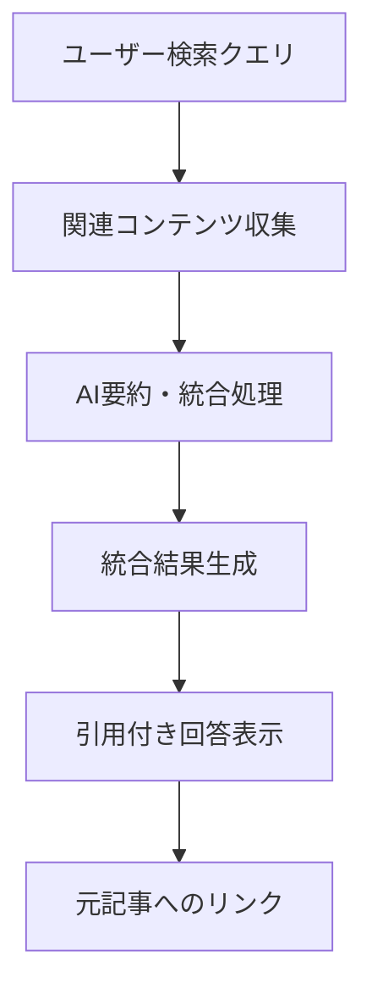

# GEO最適化構造 - 生成AI検索最適化

このドキュメントは、Perplexity、ChatGPT Search、Bing Chat等の生成AI検索エンジンで上位表示されやすいコンテンツ構造を定義します。

## GEOの基本概念

### GEO（Generative Engine Optimization）とは
- **定義**: 生成AI検索エンジンが検索結果として上位表示・要約しやすくする最適化
- **対象エンジン**: Perplexity、ChatGPT Search、Bing Chat、Google SGE等
- **従来SEOとの違い**: AIが要約・統合した結果として表示される

### 生成AI検索の流れ


## GEO最適化の核心構造

### 1. 要約しやすい情報設計

**戦略**: AIが効率的に要約・統合できるコンテンツ構造を提供

**実装方法**:
- **情報ブロック化**: 独立して意味を持つ情報単位
- **階層的構造**: 全体→詳細の論理的流れ
- **重要度マーキング**: キーポイントの明示

**要約最適化の例**:
```markdown
# 副業で月10万円稼ぐ方法

## 概要（60秒で理解）
副業で月10万円稼ぐには、スキル型（プログラミング、デザイン）または時間型（配達、事務代行）のアプローチがあります。

## スキル型副業（推奨）
### プログラミング
- **収入目安**: 月5-15万円
- **必要期間**: 学習6ヶ月＋実践3ヶ月
- **代表的案件**: Webサイト制作、アプリ開発

### デザイン
- **収入目安**: 月3-12万円  
- **必要期間**: 学習3ヶ月＋実践3ヶ月
- **代表的案件**: ロゴ制作、バナー作成
```

### 2. AI統合に適した構造

**戦略**: 複数の情報源と統合されやすい標準的な構造を採用

**実装方法**:
- **共通フォーマット**: 業界で標準的な情報整理方法
- **比較可能な指標**: 他の情報源と数値比較しやすい形式
- **引用しやすい単位**: 文脈に依存しない独立した情報

**統合最適化の例**:
```markdown
## 投資商品比較表

| 商品種類 | 期待利回り | リスクレベル | 最小投資額 | 流動性 |
|---------|------------|-------------|------------|---------|
| 株式投資 | 5-10% | 高 | 1万円〜 | 高 |
| 債券投資 | 2-4% | 中 | 10万円〜 | 中 |
| 不動産投資 | 4-8% | 中高 | 100万円〜 | 低 |

### 各商品の特徴
#### 株式投資
- **メリット**: 高いリターン期待、少額から開始可能
- **デメリット**: 価格変動リスク、専門知識が必要
- **適合者**: リスク許容度が高い、長期投資志向
```

### 3. 検索意図への直接対応

**戦略**: ユーザーの検索意図に直接答える構造を提供

**実装方法**:
- **疑問解決型**: よくある質問への明確な回答
- **比較検討型**: 選択肢の客観的比較
- **手順説明型**: ステップバイステップの実行方法

**検索意図対応の例**:
```markdown
# 「プログラミング 独学 期間」への対応

## 結論（検索者が最も知りたい情報）
プログラミング独学に必要な期間は**6-12ヶ月**です（就職レベル到達まで）。

## 言語別学習期間目安
- **Python**: 6ヶ月（基礎）+ 3ヶ月（実践）
- **JavaScript**: 8ヶ月（基礎）+ 4ヶ月（実践）  
- **Java**: 10ヶ月（基礎）+ 6ヶ月（実践）

## 期間短縮のコツ
1. 毎日2-3時間の学習時間確保
2. 実践プロジェクトの早期開始
3. メンターやコミュニティの活用
```

## GEO効果を高める構造要素

### 1. メタ情報の最適化

**要約用メタデータ**:
```markdown
---
title: "副業で月10万円稼ぐ具体的な方法【2024年版】"
summary: "スキル型・時間型の副業アプローチと収入目安、必要期間を具体的に解説"
keywords: ["副業", "月10万", "在宅ワーク", "スキルアップ"]
difficulty: "初級"
time_required: "3-6ヶ月"
---
```

### 2. 引用しやすいデータポイント

**独立性のある情報単位**:
```markdown
### 重要な統計データ
> 副業実践者の68%が月5万円以上の収入を達成（2024年副業実態調査、n=1,200）

### 実践的な数値目安
- Web制作案件の単価：5-30万円/件
- デザイン案件の単価：1-10万円/件  
- プログラミング時給：2,000-5,000円
```

### 3. AIが理解しやすい関連性

**明確な情報の関連付け**:
```markdown
## 関連情報の整理

### 前提知識
- 基本的なPC操作スキル
- 週10時間以上の作業時間確保

### 関連記事
- [プログラミング学習ロードマップ]
- [副業案件の探し方]
- [確定申告の基礎知識]

### 次のステップ
1. スキル選択（この記事で学習）
2. 学習計画立案
3. ポートフォリオ作成
```

## GEO測定と改善

### 効果測定指標

**直接指標**:
- 生成AI検索での表示頻度
- 引用される情報の正確性
- 元記事への流入数

**間接指標**:
- 検索クエリでの可視性向上
- ブランド認知度の向上
- エンゲージメント率の向上

### 継続的改善プロセス

1. **パフォーマンス監視**: 月次でGEO効果を測定
2. **競合分析**: 同一検索クエリでの他社表示状況
3. **構造最適化**: AIの要約パターン変化への対応
4. **内容更新**: 最新情報での鮮度維持

## GEO実装チェックリスト

### 構造設計
- [ ] 情報が独立したブロック単位で整理されている
- [ ] 階層構造が論理的で理解しやすい
- [ ] 重要ポイントが明確にマーキングされている
- [ ] 比較・選択肢が表形式で整理されている

### 内容品質
- [ ] 検索意図に直接答える内容を冒頭に配置
- [ ] 具体的な数値・期間・手順を含んでいる
- [ ] 統計データに信頼できる出典を明記
- [ ] 関連情報との関係性が明確

### AI最適化
- [ ] 要約しやすい文章構造
- [ ] 引用しやすい独立した情報単位
- [ ] メタデータが適切に設定されている
- [ ] 更新頻度が適切に保たれている

この構造により、生成AI検索エンジンでの表示機会と引用品質を最大化できます。