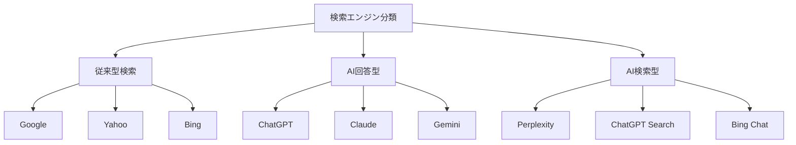

# マルチエンジンSEO戦略 - 統合検索最適化

このドキュメントは、従来検索エンジン（Google等）とAI検索エンジン（ChatGPT Search、Perplexity等）の両方で効果を発揮する統合SEO戦略を定義します。

## マルチエンジン環境の理解

### 検索エンジンの3カテゴリ



### 各エンジンの特性比較

| エンジン種類 | 情報取得方法 | ランキング要因 | ユーザー体験 | 最適化重点 |
|-------------|-------------|---------------|-------------|-----------|
| 従来型 | クローラー | PageRank, 関連性 | リンクリスト | SEO技術 |
| AI回答型 | 学習データ | 情報品質, 構造 | 直接回答 | AEO技術 |
| AI検索型 | リアルタイム検索+AI | 関連性+要約性 | 統合回答 | SEO+AEO+GEO |

## 統合SEO戦略フレームワーク

### 1. 基盤戦略（全エンジン共通）

**コンテンツ品質の統一基準**:
- **E-A-T原則**: 専門性・権威性・信頼性
- **ユーザー価値**: 具体的で実用的な情報提供
- **情報鮮度**: 定期的な更新と最新性の維持

**基本実装**:
```markdown
# 記事の基本構造（全エンジン対応）

## 概要（60秒で理解） 
<!-- AI回答型向け：即答性 -->
[問題の結論とポイントを明記]

## 詳細解説
<!-- 従来検索向け：詳細コンテンツ -->
[段階的で論理的な説明]

## 実践ガイド  
<!-- AI検索型向け：要約しやすい構造 -->
[具体的手順とチェックリスト]

## まとめ
<!-- 全エンジン向け：要点の再確認 -->
[重要ポイントの整理]
```

### 2. エンジン特化戦略

**従来型検索エンジン（Google等）対応**:
- **技術SEO**: サイト速度、モバイル対応、内部リンク
- **キーワード最適化**: 検索ボリューム分析、競合調査
- **被リンク獲得**: 権威サイトからの自然なリンク

**AI回答型エンジン対応**:
- **質問形式最適化**: FAQ形式の見出し構造
- **ファクト重視**: 検証可能な事実とデータの提供
- **構造化情報**: リスト、表、段階的説明の活用

**AI検索型エンジン対応**:
- **要約最適化**: 要約しやすい情報ブロック設計
- **統合性**: 他の情報源と組み合わせやすい構造
- **引用性**: 独立して理解できる情報単位

### 3. 統合実装戦略

**ハイブリッド最適化の例**:
```markdown
# 副業で月10万円稼ぐ方法【2024年最新版】

<!-- メタデータ（技術SEO） -->
<title>副業で月10万円稼ぐ方法 | 初心者向け完全ガイド</title>
<meta description="副業で月10万円稼ぐための具体的手順を解説。スキル型・時間型別の収入目安と期間を詳しく紹介。">

## 結論（60秒で理解） ← AI回答型最適化
副業で月10万円稼ぐには**スキル型**と**時間型**の2つのアプローチがあります。

- **スキル型**: プログラミング、デザイン（月5-15万円、習得6ヶ月）
- **時間型**: 配達、事務代行（月3-8万円、即日開始可能）

## 詳細解説 ← 従来検索最適化

### スキル型副業の具体的収入データ
2024年クラウドソーシング実態調査（n=1,200）によると：
- Web制作案件：平均単価15万円（20-40時間/件）
- ロゴデザイン：平均単価3万円（5-10時間/件）
- プログラミング：時給3,000-5,000円

### 学習期間と投資回収
| スキル | 学習期間 | 学習費用 | 月収目安 | 投資回収期間 |
|--------|----------|----------|----------|-------------|
| HTML/CSS | 2ヶ月 | 3万円 | 5万円 | 0.6ヶ月 |
| JavaScript | 4ヶ月 | 5万円 | 10万円 | 0.5ヶ月 |
| デザイン | 3ヶ月 | 4万円 | 7万円 | 0.6ヶ月 |

## 実践ガイド ← AI検索型最適化

### ステップ1: スキル選択（1週間）
1. **現在のスキル棚卸し**
   - PC操作レベルの確認
   - 創作活動の経験有無
   - 学習可能時間の算出

2. **市場需要の調査**
   - クラウドソーシングでの案件数確認
   - 単価相場の把握
   - 競合レベルの分析

### ステップ2: 学習実践（3-6ヶ月）
[詳細手順を記載]

### ステップ3: 案件獲得（継続）
[具体的方法を記載]
```

## プラットフォーム特化最適化

### note特化戦略
- **ハッシュタグ活用**: トレンドと専門性のバランス
- **読者エンゲージメント**: コメント・スキ獲得の仕組み
- **継続投稿**: 定期更新によるアルゴリズム評価向上

### SNS連携戦略
- **Twitter**: 要約とリンク付きの拡散
- **LinkedIn**: 専門性を活かした情報発信
- **Facebook**: 詳細解説と議論喚起

## 測定・分析フレームワーク

### 統合KPI設計

**発見性指標**:
- 従来検索での順位とクリック率
- AI検索での表示・引用頻度
- SNSでの拡散・エンゲージメント

**効果指標**:
- note記事への総流入数
- 読者の滞在時間・完読率
- コンバージョン（フォロー、購読等）

### 継続改善プロセス

1. **月次分析**: 各エンジンでのパフォーマンス測定
2. **競合調査**: 同一テーマでの他社戦略分析
3. **戦略調整**: 効果の高い手法への重点シフト
4. **新技術対応**: 新しいAI検索エンジンへの対応

## マルチエンジン最適化チェックリスト

### コンテンツ品質
- [ ] E-A-T（専門性・権威性・信頼性）を満たしている
- [ ] 具体的で検証可能な情報を含んでいる
- [ ] 最新の情報に基づいて作成されている
- [ ] ユーザーの具体的課題を解決している

### 技術的要素
- [ ] ページ速度が3秒以内
- [ ] モバイルフレンドリー対応
- [ ] 適切な見出し構造（H1-H3）
- [ ] 内部リンクが論理的に配置

### AI最適化要素
- [ ] 質問形式の見出しを含んでいる
- [ ] 要約しやすい情報ブロック構造
- [ ] ファクトベースの具体的データ
- [ ] 独立して理解できる情報単位

### プラットフォーム要素
- [ ] note特有の機能を効果的に活用
- [ ] SNS拡散を意識した構造
- [ ] ハッシュタグが適切に設定
- [ ] 読者エンゲージメント設計

この統合戦略により、複数の検索エンジンで同時に高いパフォーマンスを実現できます。