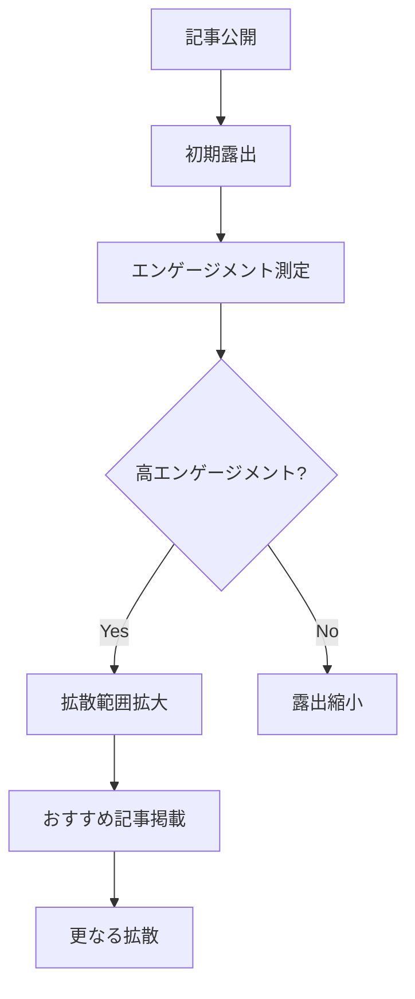

# note プラットフォーム最適化 - note特化コンテンツ戦略

このドキュメントは、noteプラットフォームの特性を活かしたコンテンツ最適化とAI検索最適化の統合戦略を定義します。

## note プラットフォームの特性理解

### noteの独自機能と特徴

**コンテンツ機能**:
- **スキ機能**: 簡単なエンゲージメント表現
- **コメント機能**: 読者との直接対話
- **フォロー機能**: 読者との継続的関係構築
- **マガジン機能**: 関連記事のシリーズ化
- **ハッシュタグ**: トピック別の記事発見

**収益化機能**:
- **有料記事**: 部分公開→有料エリア設定
- **定期購読**: 継続的な収益モデル
- **投げ銭（サポート）**: 読者からの任意支援
- **ストア機能**: デジタルコンテンツ販売

### noteのアルゴリズム特性



**アルゴリズム要因**:
1. **初期反応速度**: 公開後1-3時間のスキ・コメント数
2. **完読率**: 記事の最後まで読まれる割合
3. **滞在時間**: 記事ページでの平均滞在時間
4. **エンゲージメント率**: スキ・コメント・フォローの総合指標

## note特化コンテンツ構造

### 1. note読者に最適化した記事構造

**noteユーザーの読書パターン**:
- **モバイル中心**: 80%がスマートフォンで閲覧
- **短時間集中**: 平均滞在時間3-5分
- **感情重視**: 共感・感動を求める傾向
- **実用性**: 具体的で実践可能な情報を好む

**最適化された記事構造**:
```markdown
# [感情に訴える魅力的なタイトル]

## 導入（共感フック）
読者の悩み・課題に共感する内容で始まる
「○○で悩んでいませんか？」
「私も同じ経験をしました」

## 核心（価値提供）
### 解決策の提示
具体的で実践可能な方法を明示

### 根拠・体験談
個人の体験と客観的データの組み合わせ

## 実践（行動促進）
### やってみよう
読者が今すぐできるアクション

### 期待できる変化
実践した場合の具体的な効果

## まとめ（関係継続）
### 要点の整理
重要ポイントの再確認

### 次のステップ
関連記事やフォローへの誘導
```

### 2. スマートフォン最適化

**読みやすさの改善**:
```markdown
## スマホ読みやすさのルール

### 文章構造
- 1段落は3-4行まで
- 改行を効果的に活用
- 箇条書きを多用

### 視覚的工夫
- **太字**での重要ポイント強調
- > 引用ブロックでの印象的な発言
- 数字や記号を活用した整理

### 具体例
❌ 悪い例:
長い文章が続いて改行もなく読みにくい状態が続いている場合、読者は途中で離脱してしまう可能性が高くなります。

✅ 良い例:
長い文章は読者の離脱を招きます。

以下の工夫で改善できます：
・適切な改行
・短い段落
・視覚的なメリハリ
```

## AI検索最適化とnote機能の統合

### 1. ハッシュタグ戦略とSEO統合

**ハッシュタグのAI最適化**:
```markdown
## 戦略的ハッシュタグ設計

### Primary ハッシュタグ（1-2個）
メインキーワードに対応：
#副業 #プログラミング学習

### Secondary ハッシュタグ（2-3個）  
関連キーワード・読者層に対応：
#在宅ワーク #スキルアップ #初心者向け

### Long-tail ハッシュタグ（1-2個）
具体的な検索意図に対応：
#月10万円稼ぐ方法 #未経験からエンジニア

### 使用例
```
#副業 #プログラミング学習 #在宅ワーク #スキルアップ #月10万円稼ぐ方法
```
**総数**: 5-6個（note推奨範囲内）
**戦略**: AI検索でも発見されやすいキーワード選択
```

### 2. マガジン機能とコンテンツシリーズ化

**AI検索フレンドリーなマガジン設計**:
```markdown
## 「副業で月10万円チャレンジ」マガジン構成

### 第1章: 基礎知識編
1. 副業の基本と法的注意点
2. 自分のスキルを棚卸しする方法
3. 市場価値の高いスキルとは？

### 第2章: スキル習得編  
4. プログラミング学習の効率的な進め方
5. デザインスキルの身につけ方
6. ライティングで差をつける技術

### 第3章: 案件獲得編
7. クラウドソーシングで勝つ提案文
8. 単価交渉の心理学
9. リピート客を増やす顧客管理術

### 第4章: 収益拡大編
10. 月10万円を安定させる仕組み作り
11. さらなる収益アップの戦略
12. 独立・法人化への道筋
```

## note特有の収益化戦略

### 1. 有料記事の戦略設計

**有料エリアの価値設計**:
```markdown
## 有料記事の構造例

### 無料エリア（価値の80%提供）
- 問題の本質と解決アプローチ
- 基本的な手順の説明
- 一般的な成功事例

### 有料エリア（残り20%の決定的価値）
- 具体的なテンプレート・ツール
- 詳細な数値データ・分析
- 個別対応のアドバイス
- 失敗事例と回避方法
- 上級者向けの応用技術

### 価格設定戦略
- **100-300円**: Tips・コツ系の軽いコンテンツ
- **500-800円**: 実践ガイド・詳細手順
- **1000-1500円**: 包括的なマニュアル・テンプレート集
- **2000円以上**: 専門的分析・個別コンサル的内容
```

### 2. 定期購読モデルの設計

**継続価値の創出**:
```markdown
## 月額500円「副業成功Lab」の価値設計

### 毎週配信コンテンツ
- **月曜**: 市場トレンド分析（新しい案件情報）
- **水曜**: 実践者インタビュー（成功・失敗事例）
- **金曜**: Q&A回答（読者からの質問に回答）
- **日曜**: ツール・テンプレート配布

### 月次特典
- 限定ウェビナー参加権
- 個別相談30分（抽選5名）
- 案件紹介（条件合致者のみ）

### 年間特典  
- 対面イベント参加権
- 年間総括レポート
- 次年度戦略個別アドバイス
```

## エンゲージメント最大化戦略

### 1. スキ・コメント獲得の仕組み

**エンゲージメント誘発設計**:
```markdown
## エンゲージメント促進の具体例

### 記事末尾のCTA（Call to Action）
「この記事が役に立った方は、スキを押していただけると嬉しいです！」

「あなたの副業体験も聞かせてください。コメントでシェアしていただけると、記事の参考にさせていただきます。」

### 質問投げかけ型
「記事の中で最も印象に残ったのはどのポイントでしたか？」

「実践してみた結果、どんな変化がありましたか？」

### 選択肢提示型
「あなたはどちらのタイプですか？
A) じっくり学習派
B) 実践しながら学習派
コメントで教えてください！」
```

### 2. フォロワー増加戦略

**継続的価値の約束**:
```markdown
## フォロー促進メッセージの例

### 価値予告型
「毎週火曜日に、最新の副業トレンドと具体的な案件情報をお届けしています。見逃したくない方はフォローしてください！」

### コミュニティ型
「同じ目標を持つ仲間と情報交換しませんか？フォローしていただくと、実践者コミュニティの情報もお送りします。」

### 実績提示型
「これまで300人以上の方が副業で月5万円以上を達成された方法を、今後も発信していきます。継続的に情報を受け取りたい方はフォローをお願いします。」
```

## note特化分析・改善

### パフォーマンス測定指標

**note特有の指標**:
- **スキ率**: ビュー数に対するスキ数の割合
- **コメント率**: エンゲージメントの質の指標
- **フォロー転換率**: 記事からフォローへの転換率
- **有料記事転換率**: 無料記事から有料記事への転換

### A/Bテスト例

**タイトル最適化テスト**:
```markdown
## タイトルパフォーマンス比較

### パターンA（結果重視型）
「副業3ヶ月で月10万円稼いだ具体的な方法」
→ クリック率: 2.3%、スキ率: 1.8%

### パターンB（感情共感型）
「サラリーマンの私が副業で人生を変えた話」  
→ クリック率: 3.1%、スキ率: 2.4%

### パターンC（疑問解決型）
「副業で本当に稼げるの？3ヶ月間の実証実験」
→ クリック率: 3.7%、スキ率: 2.8%

**結論**: 疑問解決型が最も効果的
```

## note最適化チェックリスト

### コンテンツ品質
- [ ] スマートフォンでの読みやすさを確保
- [ ] 3-5分で読める適切な文量
- [ ] 感情に訴える導入部分
- [ ] 具体的で実践可能な情報提供

### プラットフォーム最適化
- [ ] 戦略的ハッシュタグ設定（5-6個）
- [ ] 適切なマガジン分類
- [ ] 読者との相互作用設計
- [ ] 収益化戦略との整合性

### エンゲージメント設計
- [ ] 明確なCTA（行動喚起）
- [ ] コメント誘発の質問・話題提供
- [ ] フォロー価値の明示
- [ ] 継続的関係構築の仕組み

### AI最適化連携
- [ ] AI検索でも発見されやすい構造
- [ ] 引用されやすい情報の配置
- [ ] noteとAI検索の相互流入設計
- [ ] クロスプラットフォーム戦略

この最適化戦略により、noteプラットフォームの特性を最大限活用しながら、AI時代の検索にも対応したコンテンツ運営を実現できます。