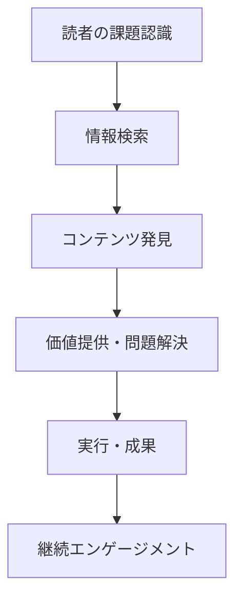
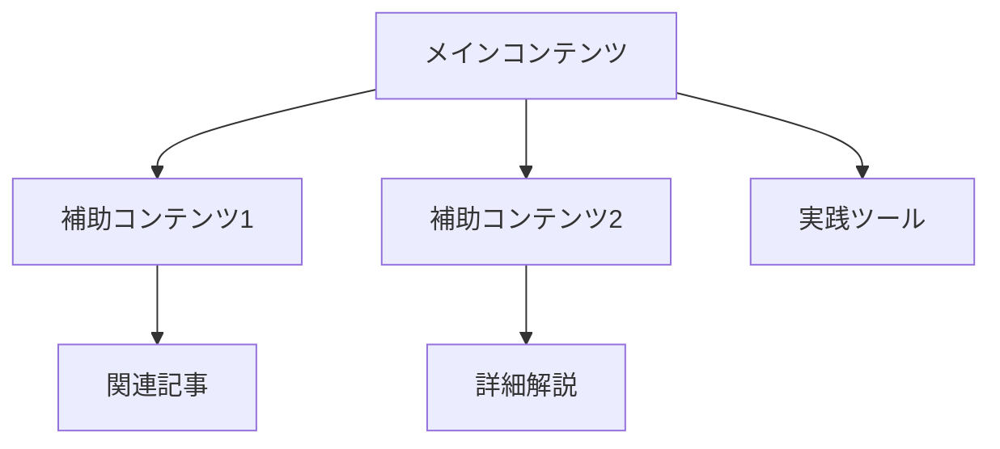

# コンテンツ企画書: [コンテンツタイトル]

## メタデータ
- **コンテンツID**: [ID]
- **シリーズ名**: [シリーズ名]
- **作成日**: [YYYY-MM-DD]
- **対象プラットフォーム**: note.com + AI検索エンジン最適化
- **制作規模**: [シンプル/標準/包括的]

## 企画概要

### コンテンツの目的
[このコンテンツを制作する目的を1-2文で明確に記述]

### 読者価値
[読者が得る具体的な価値・成果を箇条書きで記述]
- 価値1: [具体的な価値]
- 価値2: [具体的な価値]
- 価値3: [具体的な価値]

### 問題解決
[このコンテンツが解決する読者の課題・問題]

## ターゲット読者

### プライマリー読者
- **属性**: [年齢層、職業、経験レベル等]
- **ニーズ**: [具体的なニーズ・課題]
- **検索行動**: [AI検索/従来検索での検索パターン]

### セカンダリー読者（該当する場合）
- **属性**: [年齢層、職業、経験レベル等]
- **ニーズ**: [具体的なニーズ・課題]

## コンテンツ戦略

### AI最適化戦略
#### AEO（Answer Engine Optimization）
- **質問形式設計**: [想定される読者の質問]
- **構造化情報**: [AI引用されやすい情報の配置方法]
- **ファクトベース記述**: [検証可能な事実・データの活用方法]

#### GEO（Generative Engine Optimization）
- **要約最適化**: [AI検索での要約表示最適化]
- **階層構造**: [見出し構成での情報整理]
- **キーワード戦略**: [自然な文脈でのキーワード配置]

### note特化戦略
- **エンゲージメント設計**: [スキ・コメント・フォロー獲得方法]
- **ハッシュタグ戦略**: [効果的なハッシュタグの組み合わせ]
- **収益化戦略**: [有料記事/無料記事の価値分配]

## コンテンツ構成

### 記事構成
1. **[見出し1]**: [内容概要]
2. **[見出し2]**: [内容概要]
3. **[見出し3]**: [内容概要]

### コンテンツ形式
- **メインコンテンツ**: [テキスト/図表/事例等]
- **補助コンテンツ**: [チェックリスト/テンプレート/ツール等]
- **相互作用要素**: [質問投げかけ/コメント促進等]

## 成功指標

### 定量的指標
- **AI引用数**: [目標値]
- **エンゲージメント**: スキ数[目標値]、コメント数[目標値]
- **フォロー転換**: [目標値]
- **収益指標**: [有料記事の場合の転換率等]

### 定性的指標
- **読者満足度**: [満足度の測定方法]
- **実用性**: [読者の行動変化・成果]
- **権威性向上**: [専門性・信頼性の向上]

## プラットフォーム戦略

### note.com最適化
- **投稿タイミング**: [最適な投稿時間帯]
- **マガジン設計**: [シリーズの場合のマガジン活用]
- **モバイル最適化**: [スマートフォン読者への配慮]

### マルチプラットフォーム展開
- **SNS連携**: [Twitter/LinkedIn等での拡散戦略]
- **外部メディア**: [他プラットフォームでの展開可能性]

## 制作要件

### 必須要件（Must Have）
- [必ず含めるべき要素]
- [満たすべき品質基準]

### 推奨要件（Should Have）
- [含めることが望ましい要素]
- [追加価値となる要素]

### 除外事項（Won't Have）
- [意図的に含めない要素]
- [スコープ外の事項]

## 関連情報

### 参考資料
- [参考にする情報源・データ]
- [関連する既存コンテンツ]

### 用語・定義
- **用語1**: [定義]
- **用語2**: [定義]

## 図表・mermaid記法

### 読者ジャーニー図

### コンテンツマップ図

## 実装注意事項

### 品質基準
- AI最適化スコア: [基準値]以上
- note最適化: 全要件クリア
- 読者価値: 具体的・実践可能な価値提供

### 制作フロー
- content-schedule-plannerによる投稿スケジュール作成
- content-executorによる実際の制作実行
- content-reviewerによる品質確認

---

**注記**: このテンプレートはコンテンツ企画書作成専用です。制作フェーズやタスク分解は含めず、「何を作るか」に専念してください。