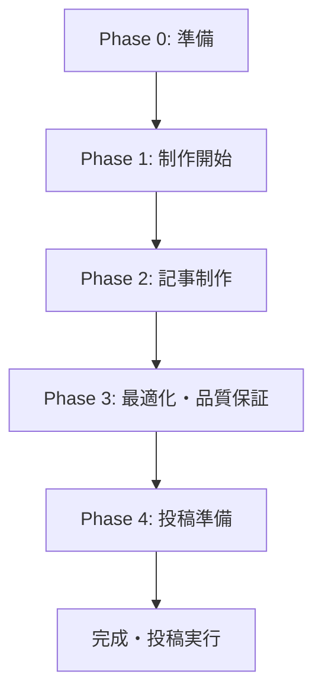
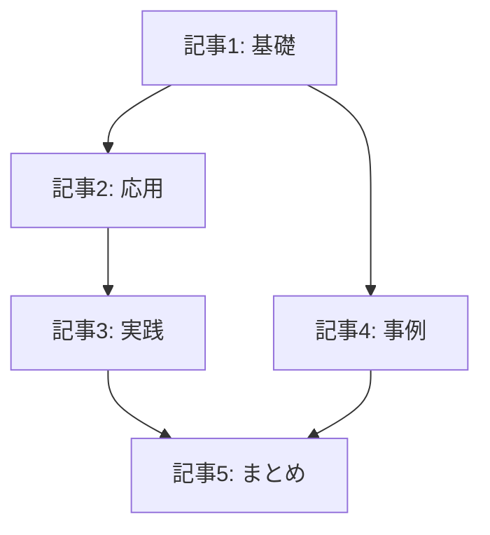

# 投稿スケジュール: [シリーズ名]

## メタデータ
- **コンテンツID**: [ID]
- **シリーズ名**: [シリーズ名]
- **制作規模**: [シンプル/標準/包括的]
- **総記事数**: [計画数]
- **想定制作期間**: [期間]
- **note機能活用**: [基本投稿/有料記事/マガジン/定期購読]

## フェーズ構成図

## コンテンツ依存関係図

## Phase 0: 準備フェーズ

### Task 0-1: 制作環境準備
- [ ] コンテンツ企画書確認完了
- [ ] 既存コンテンツ調査完了
- [ ] ライティングルール選択完了
- [ ] AI最適化要件確認完了

### Task 0-2: note機能設計確認
- [ ] ハッシュタグ戦略確定
- [ ] エンゲージメント設計確定
- [ ] 収益化設定確定（有料記事の場合）
- [ ] マガジン構成確定（シリーズの場合）

**Phase 0 完了条件**:
- 全準備タスクの完了
- 制作方針の明確化

## Phase 1: 制作開始フェーズ

### Task 1-1: [記事1タイトル]制作
- [ ] 記事構成案作成完了
- [ ] 記事執筆完了（content/articles/[ID]-01-[記事名].md）
- [ ] AEO最適化確認完了
  - 質問形式構造実装
  - 構造化情報配置確認
  - ファクトベース記述確認
- [ ] GEO最適化確認完了
  - 要約最適化確認
  - 階層構造確認
  - キーワード自然配置確認
- [ ] note最適化確認完了
  - ハッシュタグ: [#タグ1 #タグ2 #タグ3]
  - スマートフォン読みやすさ確認
  - エンゲージメント促進設計確認
- [ ] 基本品質チェック完了
- [ ] 投稿準備完了

**Phase 1 完了条件**:
- 第1回記事の完全完成
- AI最適化・note最適化の全要件クリア

## Phase 2: 記事制作フェーズ

### Task 2-1: [記事2タイトル]制作
- [ ] 記事執筆完了（content/articles/[ID]-02-[記事名].md）
- [ ] AEO最適化確認完了
- [ ] GEO最適化確認完了
- [ ] note最適化確認完了
- [ ] 基本品質チェック完了
- [ ] 投稿準備完了

### Task 2-2: [記事3タイトル]制作
- [ ] 記事執筆完了（content/articles/[ID]-03-[記事名].md）
- [ ] AEO最適化確認完了
- [ ] GEO最適化確認完了
- [ ] note最適化確認完了
- [ ] 基本品質チェック完了
- [ ] 投稿準備完了

**Phase 2 完了条件**:
- 計画されたすべての記事の完成
- 各記事でのAI最適化・note最適化クリア

## Phase 3: 最適化・品質保証フェーズ

### Task 3-1: シリーズ統合品質チェック
- [ ] content-reviewerによる全体品質確認実行
- [ ] シリーズ一貫性確認完了
- [ ] 読者ジャーニー確認完了
- [ ] AI最適化統合確認完了
- [ ] note最適化統合確認完了

### Task 3-2: 最終調整・改善
- [ ] 品質問題の修正完了
- [ ] 統合最適化の実装完了
- [ ] 最終品質チェック完了

**Phase 3 完了条件**:
- シリーズ全体の品質基準クリア
- content-reviewerによる承認取得

## Phase 4: 投稿準備フェーズ

### Task 4-1: 投稿戦略最終確認
- [ ] 投稿タイミング最適化確認
- [ ] ハッシュタグ戦略最終確認
- [ ] エンゲージメント促進準備完了
- [ ] 収益化設定最終確認（有料記事の場合）

### Task 4-2: マガジン・シリーズ設定
- [ ] マガジン作成・設定完了（シリーズの場合）
- [ ] 記事順序・構成最終確認
- [ ] 相互リンク設定確認

**Phase 4 完了条件**:
- 投稿準備の完全完了
- publish-content.mdでの投稿実行準備完了

## 効果測定手順

### 初期効果測定（投稿後1週間）
- **エンゲージメント指標**: スキ数、コメント数、フォロー転換率
- **AI最適化効果**: 検索流入数、AI経由アクセス数
- **プラットフォーム効果**: note内での拡散状況

### 中期効果測定（投稿後1ヶ月）
- **収益指標**: 有料記事転換率、課金収益（該当する場合）
- **権威性指標**: 専門性認知向上、引用・言及数
- **読者関係**: 継続エンゲージメント、コミュニティ形成

### 長期効果測定（投稿後3ヶ月）
- **総合ROI**: 投入リソースに対する効果
- **戦略効果**: AI検索での権威性向上
- **シリーズ効果**: 全体としての価値提供・読者満足度

## リスクと対策

### 高優先度リスク
1. **AI最適化不備**: 定期的な最適化チェック、基準値監視
2. **エンゲージメント低下**: 初期反応分析、即座改善実行
3. **品質劣化**: 段階的品質チェック、content-reviewer活用

### 注意すべきリスク
1. **投稿タイミング**: noteアルゴリズム考慮、最適時間帯選択
2. **競合コンテンツ**: 市場状況監視、差別化戦略維持
3. **技術変更**: プラットフォーム仕様変更への対応

## 成功指標と目標値

### 定量的目標
- **AI引用数**: [目標値]件
- **エンゲージメント**: スキ[目標値]、コメント[目標値]
- **フォロー転換**: [目標値]人
- **収益**: [目標値]円（有料記事の場合）

### 定性的目標
- **読者満足度**: 高品質フィードバック獲得
- **権威性向上**: 専門分野での認知度向上
- **コミュニティ形成**: 継続的な読者関係構築

---

**重要**: このスケジュールは content-executor および content-reviewer と連携して実行されます。各フェーズの完了後は必ず次フェーズ移行前に品質確認を実施してください。